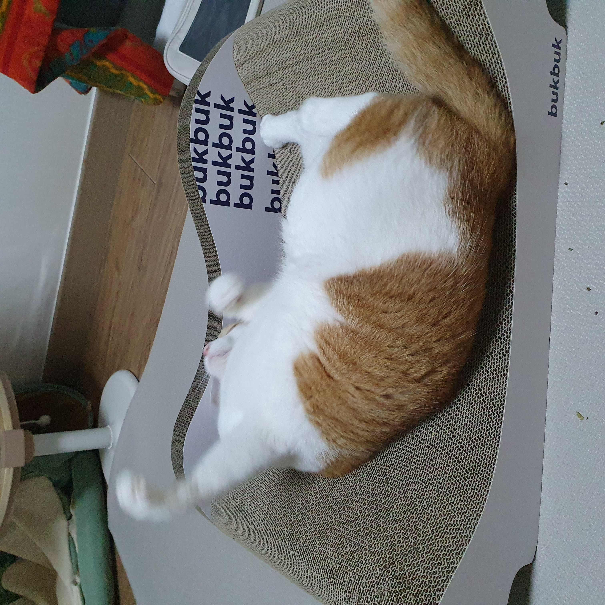

# Yet Another Mindless Linux-junkie :zany_face:

## For those interested in the projects

Refer to /docs for each project

If no /docs is there for you to read, then it means you have to parse the whole code by yourself, which is rarely commented :)

Though I'm trying to work on that...

Oh, by the way, even if there IS /docs, it cannot be guaranteed that the code becomes  understandable and readable because I'm

suuuuuuuuuper lazy to keep them up to date and to articulate the content enough

for everybody ¯\\\_(ツ)_/¯

The projects that are pinned down below are the ones most actively engaged with and most interested in for now.

## Insignificant reference

I'm documenting some none-project related materials [right here](https://github.com/seantywork/seantywork).

[This]() is GitHub page link.

Remember when you visit the site or intend to learn anything from there:

### NEVER TAKE IT SERIOUSLY ¯\\\_(ツ)_/¯ 

A cat's meowing has more meanings in it than them.

I truly and viscerally envy his life. 

I also try to upload to [Medium](https://medium.com/@seantywork).

Good day!

