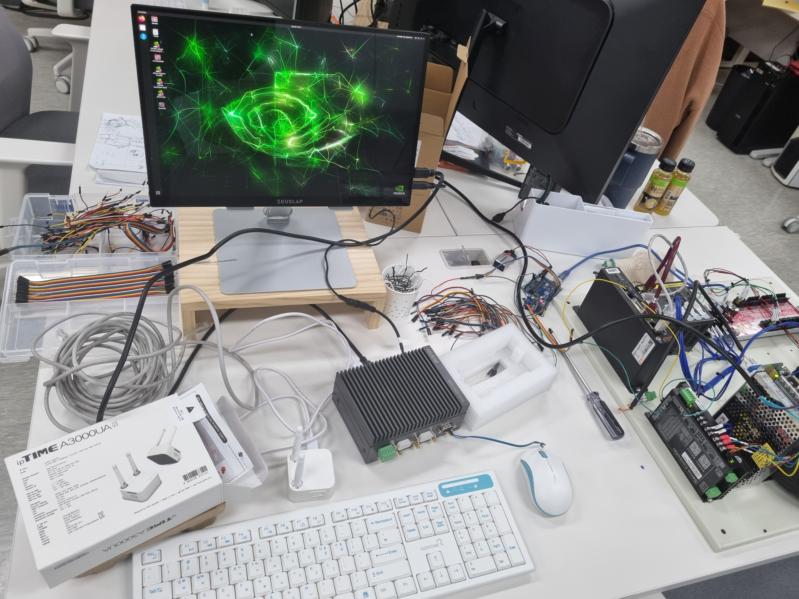

# Embedded Linux based General Purpose AGV


[This is all because of (or thanks to) ChatGPT](#this-is-all-because-of-chatgpt)

[I know what Raspberry Pi is... is Jetson Raspberry Pi?](#i-know-what-raspberry-pi-is-is-jetson-raspberry-pi)

[CAN, not a can](#can-not-a-can)

[CANopen, not CAN](#canopen-not-can)


[Jetson and the spin](#jetson-and-the-spin)


[ROS2, the savior](#ros2-the-savior)


[C/C++ plumber](#hardware-interface-optimization)


## This is all because of (or thanks to) ChatGPT

It's been only a year and a half at this company so I can't call myself an expert\
but from what I've heard from those who were before me and my brief though turbulent experiences,\
the period transitioning from the end of the year to the beginning of the coming year is when \
the developers here should be ready to do some intense crunching.

Because, due to the nature of the company R&D department where I work, it is the period when the managers and leaders of on-going projects are required to \
turn in both quantitative and qualitative results garnered throughout the year, the bid announcement for new government-funded projects is made\
and the sales pitches are drawn up ceaselessly until a blueprint for the coming year starts to materialize.

And the gigantic difference in the main themes surrounding the sales pitches being drawn up this year 2023 compared to the year\
before or even the preceding all those years followed by it was, yes, **Chat GPT**.

In South Korea, as the government tried to reign in the overall fiscal spending which includes national R&D budget, many projects that were \
directly or indirectly involved in the government funding were affected by the move and many previous blueprints or the sales pitches based\
on them were reduced in size or even entirely scrapped. 

Except one field (generally speaking).

The AI hype triggered by Chat GPT and the following prospect of "ROBOT RULES!!!", \
AI/Robotics has become the next place our sales pitch should head to as it was purported\
that that was virtually the only place the assignment would go up, not down.

The only problem was that in robotics, we had no serious real experiences nor references.


## I know what Raspberry Pi is... is Jetson Raspberry Pi?

The first time Jetson was suggested as a computing platform to run a robot, I was confused because I had never heard of the name. 

By the time, only thing from which I felt kind of confident I got the idea of how to communicate with components that make up a robot was\
Raspberry Pi 4 using GPIO...

However, as I and my teammates were brainstorming about what kind of robot we would eventually wanna get in order to win the bid, it became obvious\
that Raspberry Pi 4, despite all the great feats and decent performance it has, just wouldn't cut it.

After Google Scholar scheming through and rough but cross-checked calculations, we've come to the conclusion that Jetson Xavier NX is the lower boundary requirements \
due to the computing powers needed to run\
two vision models along with processing one 3D LiDAR, two 2D LiDAR sensors data and controlling one differential driver all simultaneously while also\
coordinating with SONAR sensors data.

It wasn't all very smooth to have our hardware (the actual robot) vendor on board with us on the calculation, but he eventually agreed to get Jetson Xavier NX\
installed.

Him and our team frequently had conversation over the details of hardware spec and how the communication protocols would be set up between machine components and \
the computer, and it was usually amicable and even joyful sometimes when our team could understand him so clearly that we could immediately come up with \
the strategies to make our unborn robot move and get things done.

...until he dropped the C word.


## CAN, not a can

I had to pretend I understand what C-A-A-N protocol means when I had first heard that over another phone call with the robot vendor.

"We're going to wire the wheels to Jetson using CAN protocol." He said.

"Oh, okay." I said.

But nothing was close to being okay at all. I immediately turned to my teammates after hanging up the phone but everyone in the room was as clueless as myself.

Again, the vicious searching and CharGPT-ing ensued. 

But, thankfully so, CAN protocol itself was very well established and easy to understand. And even better, the protocol has been incorporated in\
Linux kernel for pretty long and the eco-system around the protocol was robust. A day after we'd first heard the word "CAN", I could test out Linux\
SocketCAN interface with a simple C socket program.

Future suddenly looked bright and promising!

...until we got another call from our hardware vendor and learned what kind of wheel had been selected.


## CANopen, not CAN

"A Chinese company wheel." He said.

"Great! Can we get the CAN protocol spec manual?" I said.

"Yes. I'll send it to you."

Parsing the Chinese using Google translator, it turned out that the wheel wasn't using CAN protocol.

The wheel was using CANopen protocol, which is L7 protocol built upon CAN protocol, which is L2 one.

This revelation has been a big blow to myself being the lead of this project as much as itself was frustrating because \
one of my teammates (a very competent guy who catches on quick and has fast hands) already had hinted that there exists\
CANopen protocol and (rightly) guessed the wheel to be delivered would use not CAN but CANopen. It was I who took chance\
and hoarded baseless hope that a simple socket programming just might suffice.

Amidst my despair, was [him](https://github.com/gyuray-dev) who came to rescure. He did his own extensive study and established\
a very good sense of what's what about CANopen protocol. He shared his Notion with other teammates including me. And this turned out\
to be unexpectedly productive way of cooperating. I really learned a lot from him.

Anyway, what's still missing was the tool to handle the CANopen protocol. Due to its full-fledge protocol specifications, some considerable\
amount of socket programming might be needed to handle the whole thing properly, well, in theory.

Luckily for us, there was a tool called [CANopenLinux](https://github.com/CANopenNode/CANopenLinux) up for grasp. It was my chance to redeem myself by\
sharing how to work with this particular C-based command line tool and, in later stage when we decided to incorporate ROS2 packages,\
contributing in optimization and turning this tool into C++ integrated C library API from a messy command line tool. 

Now, with everything that is to spin the wheel soon to be arrived ready, we were starting to fill our developer hearts with anticipation.


## Jetson and the spin

Jetson and a testing board for the wheel arrived about a week later.




It took me another intense study and trials to flash Jetson Linux 35.4.1 and change rootfs of it to have a workable amount of disk space.\
It also required some weird, not stratight-forward way to install Pytorch and Torchvision. But I managed to pull them off anyway.


And as soon as I got Jetson properly configured, we successfully got the wheel spinning by sending the specified CANopen command through\
the command line tool.

It was :

```shell

# motor enable

1 w 0x6040 0 i16 0x0F

# let it spin one round slowly

1 w 0x60FF 0 i32 0x300

```

But, as usual in the settings of a software company, a challenge emerged the moment the wheel came to life.


## ROS2, the savior

Knowing "how to spin a wheel" was one thing, but knowing how to spin a wheel "to navigate" was vastly different story. 

But unlike the last time when I had let CANopen slip through my mind, I was determined not to repeat that kind of misbehavior and\
already came up with an approach to handle that problem, again thanks to the teammate.

ROS2 has some significant support for this kind of challenge where robot software developers (and hardware developers too) face some \
serious challenges such as navigating by pointing to a location on a map or based on sensor data (namely LiDAR data in our case).

Frankly, ROS2 was already on our team's mind even before Jetson was picked as our computing platform as we had explored various ways\
to appeal to the potential client ("the government bid, let's not forget that") 


## Hardware interface optimization


